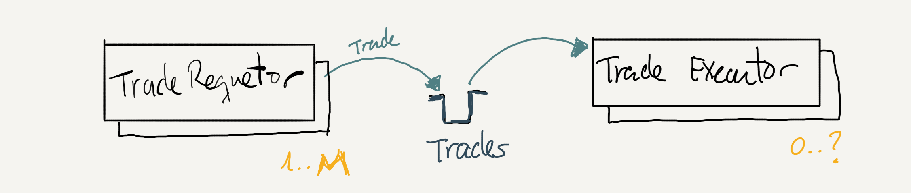
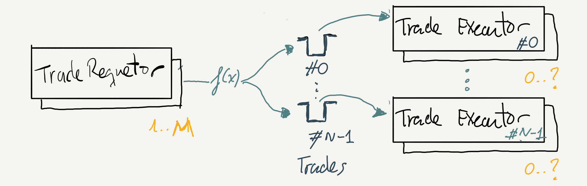
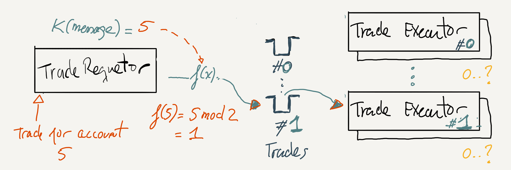
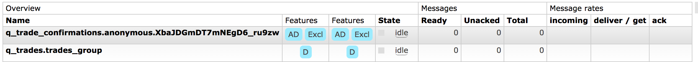

# Data Partitioning with Spring Cloud Stream over RabbitMQ

- [Introduction](#introduction)
  - [Goal of this guide](#goal-of-this-guide)
  - [Why do we do need to partition the data?](#why-do-we-do-need-to-partition-the-data)
  - [Why do we need to use Spring Cloud Stream?](#why-do-we-need-to-use-spring-cloud-stream)
- [Getting started](#getting-started)
  - [Brief introduction to Spring Cloud Stream](#brief-introduction-to-spring-cloud-stream)
  - [How Channels are bound to RabbitMQ Resources](#how-channels-are-bound-to-rabbitmq-resources)
  - [Deep-dive on How Channels are bound to RabbitMQ Resources](#deep-dive-on-how-channels-are-bound-to-rabbitmq-resources)
- [Data Partitioning](#data-partitioning)
  - [Configuring Producers](#configuring-producers)
  - [Configuring Producers](#configuring-consumers)
  - [Scaling consumers](#Scaling-consumers)
- [Resiliency](#resiliency)
  - [Producer resiliency](#producer-resiliency)
  - [Consumer Resiliency](#consumer-resiliency)
- [Bootstrapping RabbitMQ ConnectionFactory](#bootstrapping-rabbitmq-connectionfactory)

# Introduction

## Goal of this guide

The goal is to explore how to use [Spring Cloud Stream](https://docs.spring.io/spring-cloud-stream/) to partition messages in RabbitMQ.

To explore the capabilities of Spring Cloud Stream, we have created 2 sample Spring Boot applications: a **Trade Requestor** which sends *trade request* messages. Each *trade request* message contains the account who requested the trade *request*. **Trade Executor** is the second application which receives *trade request* messages and simulate their execution by printing them to the standard output.

### Scenario without data partition

The diagram below shows two applications talking over a single queue. There is no data partition here yet.



We may have many **Trade Requestor** instances (**M**) sending *trade request* messages to a **Trades** queue. And we may have one or many **Trade Executor** instances, depending on our requirements, reading from the same **Trades** queue. Check out section [Why do we do need to partition the data?](#why-do-we-need-to-use-spring-cloud-stream) for more details.
> We may have zero **Trade Executor** instances (`0`) reading from the **Trades** queue. And we may have up to 1 instance if we want to process messages in strict order or many if we are not concerned with ordering. We will discuss this shortly in more depth.

What happens if we have to process *trade request*(s) in order (e.g. FIFO)? In that case, we cannot have more than one **Trade Executor** instance, hence the question mark in the diagram resolves to **1**.

### Scenario with data partition

The diagram below shows the same two applications but this time we have partitioned the messages based on some criteria that we will see shortly. Rather than one we have as many **Trades** queues as partitions (denoted by the letter **N**) we want to have. Given a trade message, the **Trade Requestor** determines the partition it should go to and sends the message to the corresponding **Trades** queue.

**TL;DR**: This topology requires, at least, one **Trade Executor** instance per partition.



And this is briefly what happens when the **Trade Requestor** sends a *trade request* for account id `5` given that we have chosen at most `2` partitions.



- **Trade Requestor** invokes a function `K(message)` (known as `PartitionKeyExtractorStrategy` in [Spring Cloud Stream](https://docs.spring.io/spring-cloud-stream/docs/current/reference/htmlsingle/#partitioning)) on the message to determine which value it should use to partition the message. In our sample, we used the *account id*, whose value is `5`
- **Trade Requestor** then invokes another function `f(5)` (known as `PartitionSelectorStrategy` in [Spring Cloud Stream](https://docs.spring.io/spring-cloud-stream/docs/current/reference/htmlsingle/#partitioning)) on the value returned from the previous function which determines the partition where the message should go to. We have implemented our [own function](trade-requestor/src/main/java/com/pivotal/partitioning/TradeRequestorApplication.java#L44-L47) which takes the *account id* and calculates the modulus against the *partition count*. Which produces the partition `1`
- **Trade Requestor** sends the *trade request* to **Trades #1** queue.


## Why do we do need to partition the data?

There could be various reasons. Here are threes:
- **Ordered processing** - We need strictly ordered processing of messages but we cannot afford to have a single consumer. For this reason, we partition the messages based on the business criteria that imposes the ordering. For instance, we should process, in order, all the messages for a given account. It does not matter the order of messages between accounts.
- **Data Consistency** - In a time-windowed average calculation example, it is important that all measurements from any given sensor are processed by the same application instance.
- **Performance** - We need to increase the message throughput or reduce message latency. For that matter, we want messages to reside in multiple queues rather than just one queue. RabbitMQ uses an Erlang process per queue, this means processing messages for a queue is single threaded.

## Why do we need to use Spring Cloud Stream?

Spring Cloud Stream is a framework for building message-driven microservice applications. It has built-in support for data partition. Therefore, it sounded reasonable to use it.

Spring Cloud Stream implements Publish-Subscribe messaging pattern. It does not support Request-Reply messaging pattern although RabbitMQ does. It supports persistent (a.k.a. durable) publish-subcribe model and also non-persistent (a.k.a. non-durable) subscriptions.

In Spring Cloud Stream, each consumer creates its own queue (auto-delete, and exclusive). Spring Cloud Stream also has the concept of consumer group which allows multiple consumers to read from the same queue, in a [consumer competing pattern](https://www.enterpriseintegrationpatterns.com/patterns/messaging/CompetingConsumers.html).

# Getting started

Prerequisites:
- Java 1.8
- Maven +3.3
- Docker installed unless you are running RabbitMQ elsewhere or even locally

```bash
git clone https://github.com/MarcialRosales/rabbitmq-partitioning-with-cloud-stream
cd rabbitmq-partitioning-with-cloud-stream
```

Under the root folder we have the two Spring Boot applications:
- [Trade Requestor](trade-requestor) which will be responsible for sending *trade requests* on behalf of accounts -identified by a number which we randomly generate.
- [Trade Executor](trade-executor) which will be responsible for receiving those *trade requests* and simulate that it executes them by simply logging them to the standard output.

We want to partition the trades based on the account the trade is for. We want 2 partitions in total, hence the trades will be spread between these two partitions. This means that we will need at least 2 **trade executor** instances, one for each partition. We can have as many instances of **trade requestor** as we want.

## Running sample code

To run the trade requestor, we recommend launching a terminal and run this command from it:
```bash
cd trade-requestor
mvn install
java -jar target/trade-requestor-0.0.1-SNAPSHOT.jar
```
> We could run as many instances as we want

To run the trade executor instance 0, we recommend launching a separate terminal and run this command from it:
```bash
cd trade-executor
mvn install
java -jar target/trade-executor-0.0.1-SNAPSHOT.jar --spring.cloud.stream.instanceIndex=0
```

To run the trade executor instance 1, we recommend launching a separate terminal and run this command from it:
```bash
cd trade-executor
java -jar target/trade-executor-0.0.1-SNAPSHOT.jar --spring.cloud.stream.instanceIndex=1
```

This topology guarantees ordered processing of messages because we only have one **Trade Executor** instance per partition. We can have more instances provided that their `spring.cloud.stream.instanceIndex` is between `0` and `1` (i.e. partitionCount = 2).

## Running sample code as if it were running in Cloud Foundry

Both applications have 2 dependencies that allows them to read the credentials from `VCAP_SERVICES` if the spring profile `cloud` is enabled. Each application has a `run.sh` script launches the app configured like it were running in Cloud Foundry.

**TL;DR** So that we can know if the application is reading credentials from `application.yml` or from `VCAP_SERVICES`, we need to add a user to RabbitMQ server with the credentials `bob:bob`.  `VCAP_CREDENTIALS` uses `bob:bob` whereas `application.yml` uses `guest:guest`.

Here is how we launch **Trade Executor** locally like if it were running in Cloud Foundry.
```bash
cd trade-executor
./run.sh
```


## Brief introduction to Spring Cloud Stream

Stream Cloud Stream is based on the core concept of a *Channel*. A channel, or *pipe*, can be either an input or an output channel. Input channels are used to receive messages and output channels to send them. That's it.


The application is responsible for declaring what channels it needs and to provide them to the corresponding business component that needs them.

Let's look at one of the sample applications. The **trade requestor** declares that it needs an output channel where to send *trade requests* messages. It declares the channel, `tradesEmitter`, in an interface that will act as a bridge between the messaging middleware -RabbitMQ- and the application business logic:

```Java
public interface MessagingBridge {

    @Output
    MessageChannel tradesEmitter();

}
```

That is just an interface, we need to tell Spring Cloud Stream to provide an implementation of that interface via the `@EnableBinding` annotation as shown below:
```Java
@SpringBootApplication
@EnableBinding(MessagingBridge.class)
public class TradeRequestorApplication {

  @Autowired
	private MessagingBridge messagingBridge;

  ....

}
```

Once, we have the `messagingBridge` wired onto our application, as shown above, we can use it to send messages like shown below:
```Java
public class TradeRequestorApplication {

  @Scheduled(fixedRate = 5000)
  public void produceTradeRequest() {
    ...
    messagingBridge.tradesEmitter().send(
        MessageBuilder.withPayload(body).setHeader("account", account).build());
  }
```

We have not discussed yet how these channels map to queues and exchanges, how they are named, etc.

## How Channels are bound to RabbitMQ Resources

Spring cloud Stream uses the term `bind` to refer to mapping of the channels to the underlying messaging middleware.

A *Binder* is a messaging-middleware implementation. RabbitMQ is the implementation we use here. We declare multiple *binders* on a single application, if needed. Imagine our application needs to talk to 2 RabbitMQ clusters. Here we would need 2 binders.  

We declare the *binder* via configuration like shown below:
```yaml
spring:
  cloud:
    stream:
      binders:
        local_rabbit:
          type: rabbit
          environment:
            spring:
              rabbitmq:
                host: localhost
                port: 5672
                username: guest
                password: guest
                virtual-host: /
```
> Extracted from [trade-requestor/src/main/resources/application.yml](trade-requestor/src/main/resources/application.yml)

A *Binding* is the mapping of a channel to a destination in a configured *binder*. Below we see the *bindings* for the *Output* channel `tradesEmitter` ([MessagingBridge.tradesEmitter()](trade-requestor/src/main/java/com/pivotal/partitioning/MessagingBridge.java#L10)) which is mapped to the `local_rabbit` *binder* we declared above.
```yaml
spring:
  cloud:
    stream:
      bindings:
        tradesEmitter:
          destination: trades
          binder: local_rabbit
          producer:
            partitionCount: 2
            requiredGroups: trades_group
            partitionKeyExpression: headers['account']
            partitionSelectorName: partitionSelectorStrategy  

```
> Also extracted from [trade-requestor/src/main/resources/application.yml](trade-requestor/src/main/resources/application.yml)


## Deep-dive on How Channels are bound to RabbitMQ Resources

By default, the RabbitMQ Binder implementation maps each destination to a *TopicExchange*.

For each consumer group, a Queue is bound to that TopicExchange. Each consumer instance has a corresponding RabbitMQ Consumer instance for its group’s Queue. For anonymous consumers, an auto-delete queue (with a randomized unique name) is used.

We know that a channel is a *pipe* abstraction used in Spring Cloud Stream. The name of the channel is what we define in the annotation `@Sink` or `@Source`,
for instance when we declared these
```Java
    @Input(TRADES)
    SubscribableChannel trades();

    @Input(TRADE_CONFIRMATION)
    SubscribableChannel tradeConfirmations();

```
A channel will be mapped to an exchange and ultimately to one queue -in case of specifying one consumer group- or
one queue per consumer/listener -in case of not using consumer groups.

Let's understand how exchanges and queues are named.

Let's start first how channels are named and we will use one of the channels we used in our application. The name of the channel we used for **trades**
is given by the constant `TRADES`. If we did not specify any name, it would have taken the name of the annotated method, in our case it would be `trades`.

The exchange is named after the channel name if we did not configure a `destination` for the channel in the `bindinds`
configuration entry. See below (extracted from `application_no_consumer_groups.yml`). The channel named `trades` has a destination called `q_trades` therefore the exchange
will be named `q_trades` of type *Topic*.

```yaml
spring:
  cloud:
    stream:
      bindings:
        trades:  # com.pivotal.partitioning.TRADES
          destination: q_trades
          binder: local_rabbit
          group: trades_group
        tradeConfirmations:  # com.pivotal.partitioning.TRADE_CONFIRMATION
          destination: q_trade_confirmations
          binder: local_rabbit

```

And queues are named differently depending whether we use *consumer groups* or not. If we do not use consumer groups, each listener will create
a queue named as follows `<channel_destination_name>.anonymous.<unique_id>` e.g. `q_trade_confirmations.anonymous.XbaJDGmDT7mNEgD6_ru9zw`.
If the channel is configured with *consumer groups*, then it will be named as follows `<channel_destination_name>>.<consumer_group_name>` e.g. `q_trades.trades_group`.


Consumer group subscriptions are durable. Anonymous subscriptions are non-durable by nature.
In general, it is preferable to always specify a consumer group when binding an application to a given destination. It only makes sense
to not use consumer groups when our consumers do not want to process messages that occur while they are not listening.

The producer will send a message with the routing key `<destination_name>-<partition_key>`, e.g. `q_trades-0`. And the queue `q_trades.trades_group-0` is bound to the
exchange `q_trades` with that routing key.

All this information is available via the actuator endpoint: `curl localhost:8080/actuator/bindings | jq .`

For more details about Spring Cloud Stream, specially around how to use Spring Cloud Stream to build a complex topology of interconnected consumer and producer applications check out [Spring Cloud Stream app starters](https://github.com/spring-cloud-stream-app-starters) repo.

# Data Partitioning

We need to configure *partitioning* in the producer and in the consumer side. And in terms of Spring cloud Stream, that means configuring the output and input *bindings*.

Key configuration:
- **Producers** need to know how many partitions there will be so that they know how to split the data. [here](trade-requestor/src/main/resources/application.yml#L10) is how *trade requestor* does it.
- **Consumers** need to know which partition they will be reading from. Each consumer instance must be configured with an instance identifier. For instance, earlier on we ran the *trade executor* application with the argument `--spring.cloud.stream.instanceIndex=0`.

In the next two sections we discuss in greater detail what it takes to configure producers and consumers although the key configuration is what we just said above.

## Configuring Producers

We need to tell producers which is the partition key to use. In our particular case, the partition key is the account id the trade belongs to. This can be configured into ways:

- One way is to define an SpEL expression that when evaluated against the outgoing message it returns the value to partition. This expression is configured in the property  `spring.cloud.stream.bindings.<channel_name>.producer.partitionKeyExpression`
- Another way is to define our own custom logic and create an instance of that logic and expose it as a @Bean. We set the name of the @bean in `spring.cloud.stream.bindings.<channel_name>.producer.partitionKeyExtractorName`

We saw earlier that the key property we need to configure is `spring.cloud.stream.bindings.<channel_name>.producer.partitionCount`. The partition number must be between 0 and `partitionCount`- 1. This value is obtained using the formula:
 `key.hashCode() % partitionCount`. However, we can provide our own formula implementing `org.springframework.cloud.stream.binder.PartitionSelectorStrategy`
 similar to how we did it for partition key selection. And specify the @Bean name via the property `partitionSelectorName`.

### Message delivery

A key configuration attribute is called `requiredGroups` whose value matches the consumer's `group` attribute. If we set this value, the producer app (**Trade Requestor**) declares as many queues as indicated by the `partitionCount` attribute. This means that we do not need to wait for the consumer (**Trade executor**) to declare them. This has one advantages which is that there will always be a queue for the messages and therefore we do not lose them if the **Trade Executor** has not declare the queues yet. The disadvantage is that we are coupling the producer with the consumer. The consumer may want to use a different queue name.

## Configuring Consumers

We need to tell the consumer that it would be consuming from a partition.
`spring.cloud.stream.bindings.<channel_name>.consumer.partitioned: true`

### Strict ordering

If we need to have strict ordering of processing of messages we need to use `exclusive: true` attribute. If we have more instances, they will fail to subscribe but will retry based on the `recoveryInterval: 5000` attribute.

### Message delivery

By default, Spring Cloud Stream will use client acknowledgement (`acknowledgeMode: AUTO`). It will reject messages if the application failed to process and it will not requeue them. We can change this behaviour though with `requeueRejected: true`. But be careful changing this value because it could produce a storm of poisonous messages unless the application raises an `AmqpRejectAndDontRequeueException`.

## Scaling consumers

We can run as many instances of the **trade executor** application as needed provided they are configured with an instance identifier which is between 0 and `partitionCount - 1`. Where the `partitionCount` is defined in the [**trade requestor** application](trade-requestor/src/main/resources/application.yml#L10).

However, when we deploy the application to Cloud Foundry,
Spring Cloud Stream uses the  [CF_INSTANCE_INDEX](https://docs.cloudfoundry.org/devguide/deploy-apps/environment-variable.html#CF-INSTANCE-INDEX) environment variable to [configure](https://github.com/spring-cloud/spring-cloud-stream/blob/master/spring-cloud-stream/src/main/java/org/springframework/cloud/stream/config/BindingServiceProperties.java#L66) `spring.cloud.stream.instanceIndex` property if we have not set it yet.

If we are using [Cloud Foundry auto-scaling](https://docs.run.pivotal.io/appsman-services/autoscaler/using-autoscaler.html) feature, we have to set/override by round-robin the instances among the partitions. This means instance 0 will go to partition 0, instance 1 to partition 1, but instance 2 will go to partition 0, and so forth.

These is what it takes to deploy the **Trade Executor** application in Cloud Foundry:
  - [Declare the number of partitions](trade-executor/manifest.yml#L5) in the manifest.yml that we will use to push the application to Cloud Foundry.
  - [Set the `instanceIndex` so that it round-robins CF_INSTANCE_INDEX around the number of partitions](trade-executor/.profile) in the .profile file that we will be sent when we push the application to Cloud Foundry

There is another [manifest.yml](trade-requestor/manifest.yml) but it is not really important except that it allows us to override the number of partitions defined in the [application.yml](trade-requestor/src/main/resources/application.yml).


### Changing partition count and/or partition selection strategy

Once we have partition queues with data we cannot change the number of partitions and/or the partition strategy because we could end up with a partition key in more than one partition queue.

e.g.

We start **Trade Requestor** with `partitionCount: 2`. We two **Trade Executor** with `instanceId: 0` and `instance:1` respectively. At this point, we have 2 empty queues, `trades.trades_group-0` and `trades.trade_group-1`.

**Trade Requestor** sends 2 messages:
  - one for `accountId: 2` which goes to partition `0`
  - and another for `accountId: 3` which goes to partition `1`

If we launched a third **Trade Executor** with `instanceId: 2`, it would not have any effect. It would create a third queue, `trades.trades_group-2`, but none would be writing to it.

However, if we launched **Trade Requestor** with `partitionCount: 3` either while the other **Trade Requestor** with `partitionCount: 2` is running or not, it has a pretty bad effect.
Before we launched it,
  - `trades.trades_group-0` queue has a trade for `accountId: 2`
  - and `trades.trade_group-1` has a trade for `accountId: 3`

However, once the new **Trade Requestor** with `partitionCount: 3` starts, it will be using a different account to partition allocation.
  - `accountId: 2` would be allocated to partition `2` not `0`
  - and `accountId: 3` would be allocated to partition `0` not `1`
If **Trade Requestor** sent trades for both accounts, it would result in trades for `accountId: 2` in two queues.


What options do we have to change the number of partitions?
At a very high level we can see two strategies:
  - One that attempts to **use the existing queues**.   
  It would be highly recommended to [Consistent Hashing](https://en.wikipedia.org/wiki/Consistent_hashing) algorithm as the partition selection strategy rather than the plain modulus operand. This will significantly reduce the amounts of mapping/reallocation of messages to the new partition. This strategy would require to pause the producer and consumer applications until we have completed the re-partition.
  - and another which **creates a new set of queues** according to the new partition strategy.  
  Similar to the blue/green deployment strategy. This means, stopping the current producer applications, launching new set of applications (producers and consumers) that uses the new queues. Wait for the old queues to drain before stopping the old consumers. This will mechanism guarantees an strict ordering of messages.


# Resiliency

## Producer resiliency

Spring Cloud Stream uses the Spring Retry library to facilitate successful message processing. See Retry Template for more details.

**spring.cloud.stream.bindings.<channel>.producer.requiredGroups** - A comma-separated list of groups to which the producer must ensure message delivery even if they start after it has been created (for example, by pre-creating durable queues in RabbitMQ).

If retry is enabled (maxAttempts > 1), failed messages are delivered to the DLQ after retries are exhausted. If retry is disabled (maxAttempts = 1), you should set requeueRejected to false (the default) so that failed messages are routed to the DLQ, instead of being re-queued. In addition, republishToDlq causes the binder to publish a failed message to the DLQ (instead of rejecting it). This feature lets additional information (such as the stack trace in the x-exception-stacktrace header) be added to the message in headers.
(https://docs.spring.io/spring-cloud-stream/docs/current/reference/htmlsingle/#_rabbitmq_binder_overview)

**spring.cloud.stream.bindings.<channel>.producer.deliveryMode** - Delivery mode is PERSISTENT by default.


## Consumer Resiliency


# Bootstrapping RabbitMQ ConnectionFactory

Credentials coming from Cloud Connectors will be preferred over credentials coming over local spring configuration (.ak.a. auto-configuration).
This can be changed with this setting `spring.cloud.stream.overrideCloudConnectors`
More details here https://docs.spring.io/spring-cloud-stream/docs/current/reference/htmlsingle/#_binding_service_properties

TODO expand applications so that they get the credentials from VCAP_SERVICES and deploy them in Cloud Foundry


# Operations

## Monitoring metrics

We have exposed the `metrics` endpoint of the [actuator ](https://docs.spring.io/spring-boot/docs/current/reference/html/production-ready-endpoints.html). It exposes metrics for `rabbitmq ` such as number of connections and for `spring integration` which is the library used by Spring Cloud Stream to talk to RabbitMQ.

```bash
curl localhost:8080/actuator/metrics | jq .names | rabbitmq
"rabbitmq.not_acknowledged_published",
"rabbitmq.published",
"rabbitmq.acknowledged",
"rabbitmq.channels",
"rabbitmq.connections",
"rabbitmq.rejected",
"rabbitmq.acknowledged_published",
"rabbitmq.unrouted_published",
"rabbitmq.consumed",
"rabbitmq.failed_to_publish",

curl localhost:8080/actuator/metrics | jq .names | grep integ
  "spring.integration.channels",
  "spring.integration.handlers",
  "spring.integration.sources"

```

We have also exposed the Spring integration endpoint which shares lots of valuable insight. This is how you can reach it. We have removed the output for brevity.
```
curl localhost:8080/actuator/integrationgraph | jq .
```

## Monitoring health status

We have also exposed the `health` endpoint (insecure for demo purposes). We can get health status for *RabbitMQ* itself and also for the `local_rabbit` *binder* we configured. Both are `UP`.

```bash
curl localhost:8080/actuator/health | jq .
```
```json
{
  "status": "UP",
  "details": {
    "rabbit": {
      "status": "UP",
      "details": {
        "version": "3.7.12"
      }
    },
    "diskSpace": {
      "status": "UP",
      "details": {
        "total": 500068036608,
        "free": 49426731008,
        "threshold": 10485760
      }
    },
    "binders": {
      "status": "UP",
      "details": {
        "local_rabbit": {
          "status": "UP",
          "details": {
            "binderHealthIndicator": {
              "status": "UP",
              "details": {
                "version": "3.7.12"
              }
            }
          }
        }
      }
    }
  }
}
```

## Gathering runtime configuration

There 2 actuator endpoints we can use to gather runtime configuration of the two applications.

> I have noticed that the credentials reported via `/configprops` or `/env` endpoints are not correct when using `cloud` profile. They show the configuration that would have been used locally.
